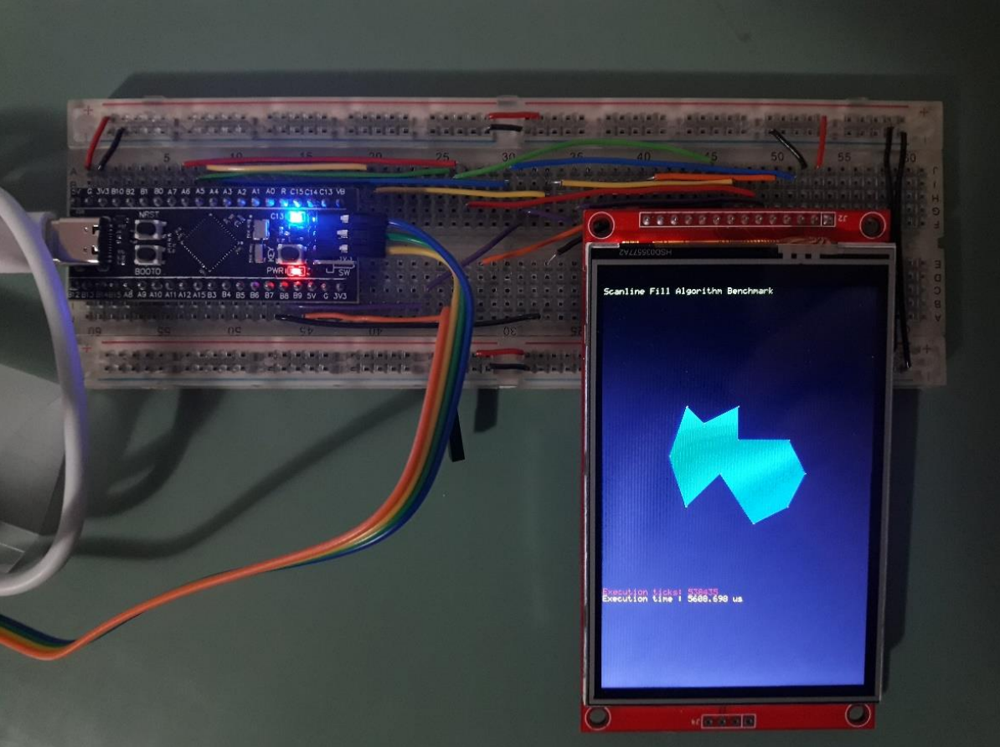
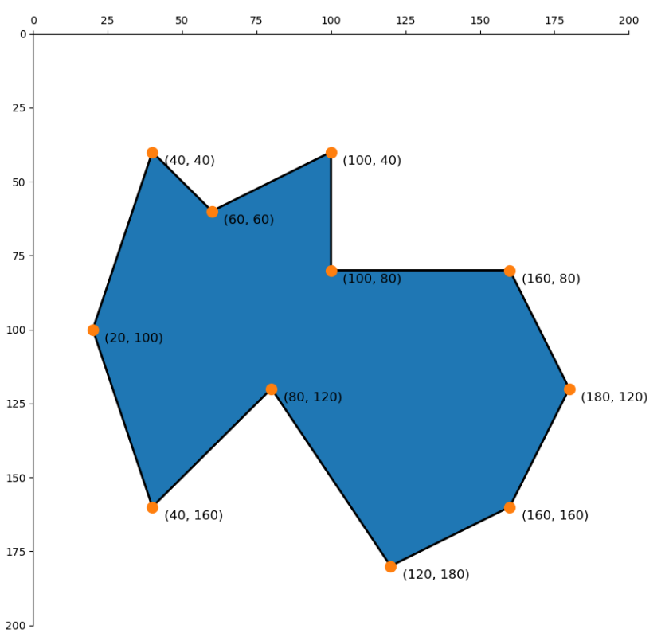

# Scanline-Fill algorithm STM32F4

Goal of this project is implementing and optimizing the scanline-fill algorithm, used to fill closed polygons.
Setup comprised of STM32F411 MCU and ILI9488 based TFT LCD, connected over SPI, shown on the following image.

The benchmarking polygon for the optimizations is presented on the following image.

## Baseline implementation

The baseline implemented the scanline fill algorithm, described with the following steps, utilizing floating-point numbers:
1. Sorting polygon points
2. Creating table of edges
3. Scanline processing

Execution time with `-O0` GCC flag is 5228 us.

## Implementation with integer numbers

For the STM32F411 it was expected that replacing the floating-point numbers with integer operations won't give big benefit, as the MCU has FPU.
Anyway, by replacing the floating-point operations in the scanling processing step with integer operations, we end up with a bit optimized version of the algorithm that has execution time of 5037 us, ~200 us faster than the baseline.

## Compiler optimizations for integer numbers implementation

With `-O3` GCC flag, the execution time comes down to 2094 us, which is a big gain.

With these project, I've come to conclusion that if the algorithm is well implemented, then we can leave the low-level optimizations to the compiler, as the compilers have very good optimizers, developed over the years and we should utilize them.
